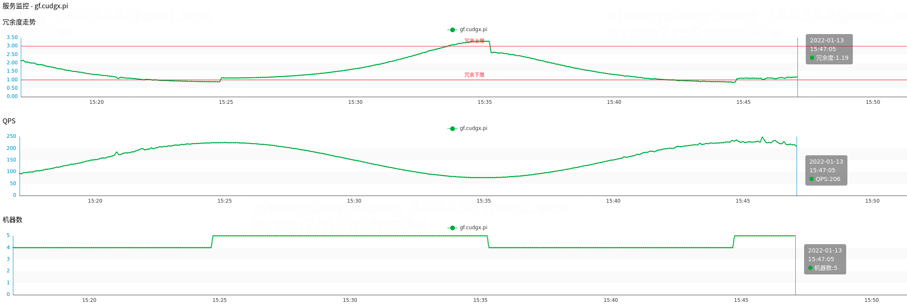

## Metrics-Go 

`metrics-go` 是CudgX指标打点SDK，它集成了监控指标和数据分析指标的能力。


### 数据流程

指标数据流程为： 
1. 用户代码调用打点程序 
2. SDK指标聚合 ，SDK会将用户的打点数据按照指定时间周期聚合（默认是1s） 
3. batch推送 ，每个聚合周期会将指标推送到CudgX-gateway中
4. CudgX-gateway将数据分发到对应Kafka Topic
5. CudgX-consumer消费数据，存储到Clickhouse
6. 用户基于Clickhouse查询指标

### 如何使用

指标分为两类： 监控指标和流式指标

监控指标： SDK聚合操作后，将数据上报至CudgX-gateway

流式指标： SDK收集指标详细数据，不做聚合，将数据上报至CudgX-gateway，后续由Flink Job对数据进行实时处理

**新建监控指标**

```go
latencyMin = metricGo.NewMonitoringMetric("latencyMin", []string{}, aggregate.NewMinBuilder())
latencyMax = metricGo.NewMonitoringMetric("latencyMax", []string{}, aggregate.NewMaxBuilder())
```

**新建流式指标**

```go
latency = metricGo.NewStreamingMetric("latency", []string{})
```

**打点**

```go
latencyMin.With().Value(float64(cost))
latencyMax.With().Value(float64(cost))
latency.With().Value(float64(cost))
```

**指标查询**




