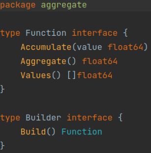
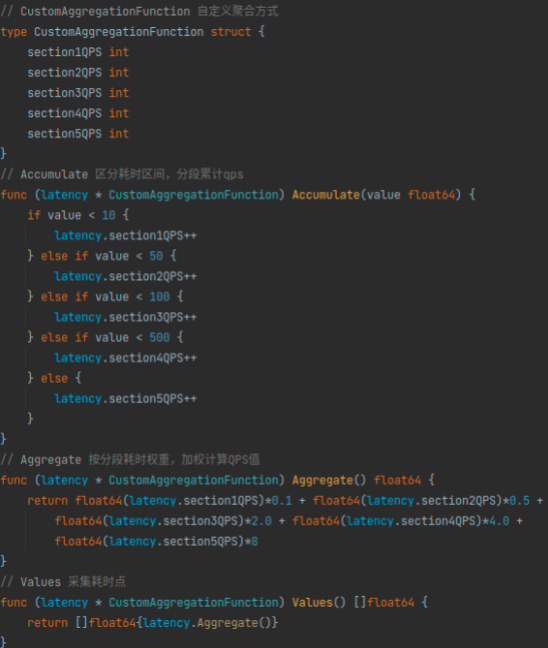
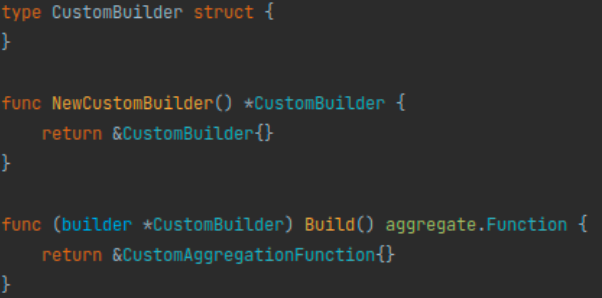
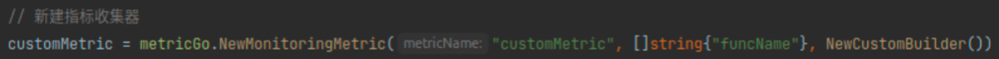
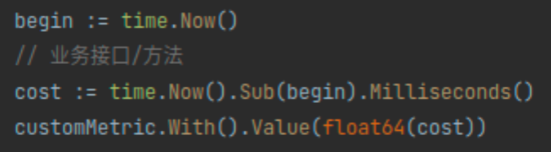

## Metrics-Go 

`metrics-go` 是cudgx指标打点工具。

### 一、数据流程

指标数据流程为： 
1. 用户代码集成SDK。
2. SDK指标聚合：SDK会将用户的打点数据按照指定时间周期聚合（默认是1s）。 
3. batch推送：每个聚合周期会将指标推送到CudgX-gateway。
4. CudgX-gateway将数据分发到Kafka。
5. CudgX-consumer消费数据，并存储至clickhouse。
6. 基于clickhouse数据查询指标。

### 二、如何使用SDK完成指标数据采集

指标分为两类： 监控指标和流式指标

- 监控指标： sdk聚合后，将数据上报至CudgX-gateway。
- 流式指标： sdk收集指标详细数据，不做聚合将数据，将数据上报至CudgX-gateway。

**1、新建指标**

（1）新建监控指标

QPS指标数据采集，示例：
```go
qps = metricGo.NewMonitoringMetric("qps", []string{}, aggregate.NewCountBuilder())
```

（2）新建流式指标

latency数据采集，示例：
```go
latency = metricGo.NewStreamingMetric("latency", []string{})
```

**2、打点（采集指标数据）**

示例：
```go
begin := time.Now()
// 业务接口/方法
cost := time.Now().Sub(begin).Milliseconds()
qps.With().Value(1)
latency.With().Value(float64(cost))
```

### 三、如何自定义指标
metric_qps指标接入示例：

**1、实现metrics-go中Function、Builder接口**



（1）实现Function intf，示例：



（2）实现Builder intf，示例：



**2、新建监控指标**

示例：



**3、打点（采集指标数据）**

示例：



**五、指标接入示例应用： cudgx-sample-pi**

[点击查看cudgx-sample-pi示例程序](https://github.com/galaxy-future/cudgx/blob/master/sample/pi/main.go)


行为准则
------
[贡献者公约](https://github.com/galaxy-future/cudgx/blob/master/CODE_OF_CONDUCT.md)

授权
-----

Metrics-Go使用[Elastic License 2.0](https://github.com/galaxy-future/cudgx/blob/master/LICENSE)授权协议进行授权

